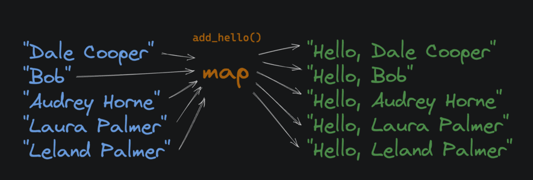

# First Class and Higher Order Functions
---

A programming language "supports first-class functions" when functions are treated like any other variable. That means functions can be passed as arguments to other functions, can be returned by other functions, and can be assigned to variables.

### 1. First-class function:
**A function that is treated like any other value**

### 2. Higher-order function:
 **A function that accepts another function as an argument or returns a function**
**Python supports first-class and higher-order functions.**

```
First-Class Example```
def square(x):
    return x * x

Assign function to a variable
f = square

print(f(5))
# 25

Higher-Order Example
def square(x):
    return x * x

def my_map(func, arg_list):
    result = []
    for i in arg_list:
        result.append(func(i))
    return result

squares = my_map(square, [1, 2, 3, 4, 5])
print(squares)
# [1, 4, 9, 16, 25]

# and using lambda makes it even cooler

def my_map_withLambda( arg_list):
    result = []
    for i in arg_list:
        result.append(lambda i: i * i)
    return result

```


## Map
|
"Map", "filter", and "reduce" are three commonly used higher-order functions in functional programming.

In Python, the built-in map function takes a function and an iterable (in this case a list) as inputs. It returns an iterator that applies the function to every item, yielding the results.


**map** function
: **With map, we can operate on lists without using loops and nasty stateful variables.** For example:
```
def square(x):
    return x * x

nums = [1, 2, 3, 4, 5]
squared_nums = map(square, nums)
print(list(squared_nums))
# [1, 4, 9, 16, 25]
```
The list type constructor, list() converts the map object back into a standard list.

Assignment
Markdown supports two different styles of bullet points, - and *. We prefer *, so, we need a function to convert any - bullet points to * bullet points.

Complete the change_bullet_style function. It takes a document (a string) as input, and returns a single string as output. The returned string should have any lines that start with a - character replaced with a * character.

For example, this:

- This is a bullet
- This is a bullet

Becomes:

* This is a bullet
* This is a bullet

Use the built-in map function to apply the provided convert_line function to each line of the input string. Use .split() and .join() to split the document into a list of lines, and then join the lines back together. This should preserve the original line breaks. Don't use the .replace() string method.

Examples of split and join:

```
# my_document is a string with newlines
lines_list = my_document.split("\n")

rejoined_doc = "\n".join(lines_list)


def change_bullet_style(document):
    lines = document.split("\n")
    processed_lines = map(convert_line, lines)
    return "\n".join(processed_lines)
    
def change_bullet_styleV2(document):
    return "\n".join(map(convert_line, document.split("\n")))       # WOOOO   !!!!!


# Don't edit below this line


def convert_line(line):
    old_bullet = "-"
    new_bullet = "*"
    if len(line) > 0 and line[0] == old_bullet:
        return new_bullet + line[1:]
    return line
```

## Filter

**The built-in filter function takes a function and an iterable (in this case a list) and returns an iterator that only contains elements from the original iterable where the result of the function on that item returned True.**


In Python:
```
def is_even(x):
    return x % 2 == 0

numbers = [1, 2, 3, 4, 5, 6]
evens = list(filter(is_even, numbers))
print(evens)
# [2, 4, 6]
```

### Assignment

Complete the remove_invalid_lines function. It accepts a document as input. It should:

Use the built-in filter function and a lambda to return a copy of the input document
Remove any lines that start with a - character.
Keep all other lines and preserve trailing newlines.
For example, this:

* Star Wars episode 1 is underrated
- Star Wars episode 9 is fine
* Star Wars episode 3 is the best


Should become:

* Star Wars episode 1 is underrated
* Star Wars episode 3 is the best


Tips
The splitlines method does not preserve trailing newlines and may cause your output to fail the tests.

The following methods may be useful:

```
.join

"\n".join(["a", "b", "c"])
# a
# b
# c

.startswith

s = "hello"
s.startswith("h")
# True
s.startswith("o")
# False

.split

s = """hello
world"""
lines = s.split("\n")
# ['hello', 'world']
```

### SOLUTION:
```

   def remove_invalid_lines(document):
        return "\n".join(
            filter(lambda x: not x.startswith("-"), document.split("\n"))
        )

run_cases = [
    (
        "\n* We are the music makers\n- And we are the dreamers of dreams\n* Come with me and you'll be\n",
        "\n* We are the music makers\n* Come with me and you'll be\n",
    ),
    (
        "\n* In a world of pure imagination\n- There is no life I know\n* Living there - you'll be free\n",
        "\n* In a world of pure imagination\n* Living there - you'll be free\n",
    ),
]
```

## Reduce

The built-in functools.reduce() function takes a function and a list of values, and applies the function to each value in the list, accumulating a single result as it goes.


```
import functools from the standard library
import functools

def add(sum_so_far, x):
    print(f"sum_so_far: {sum_so_far}, x: {x}")
    return sum_so_far + x

numbers = [1, 2, 3, 4]
sum = functools.reduce(add, numbers)
//sum_so_far: 1, x: 2
//sum_so_far: 3, x: 3
//sum_so_far: 6, x: 4
//10 doesn't print, it's just the final result
print(sum)
//10
```

Notice that we are passing the function add without the ().

It means that reduce will take care of the execution and pass the parameters for you.

Think of passing add like handing someone a recipe (the instructions), instead
of the finished dish (the result of the execution).


Assignment
Complete the join and the join_first_sentences functions.

Complete the join function. It's a helper function we'll use in join_first_sentences.
It takes two inputs:
A doc_so_far accumulator string - similar to the sum_so_far variable in the example above.
A sentence string - this is the next string we want to add to the accumulator.
Returns the result of concatenating the "doc" and "sentence" strings together, with a period and a space in between. For example:
```
doc = "This is the first sentence"
sentence = "This is the second sentence"
print(join(doc, sentence))
//This is the first sentence. This is the second sentence
```
Complete the join_first_sentences function.
It accepts two arguments:
A list of sentence strings
An integer n
If n is zero, just return an empty string.
Use functools.reduce() with your join function to combine the sliced sentences into a single string, adding a final period without a trailing space.
Use list slicing to get the first n sentences.

Here's an example of the expected behavior:
```
joined = join_first_sentences(
    ["This is the first sentence", "This is the second sentence", "This is the third sentence"],
    2
)
print(joined)
//This is the first sentence. This is the second sentence.
```

## Map, Filter, and Reduce Review

Higher-order functions like map, filter, and reduce, allow us to avoid stateful iteration and mutations of variables.

Take a look at this imperative code that calculates the factorial of a number:
```
def factorial(n):
    # a procedure that continuously multiplies
    # the current result by the next number
    result = 1
    for i in range(1, n + 1):
        result *= i
    return result
```
Here's the same factorial function using reduce:
```
import functools

def factorial(n):
    return functools.reduce(lambda x, y: x * y, range(1, n + 1))
```
In the functional example, we're just combining functions to get the result we want. There's no need to reassign variables or keep track of the program's state in a loop.

A loop is inherently stateful. Depending on which iteration you're on, the i variable has a different value.


## Zip

The zip function takes two iterables (in this case lists), and returns a new iterable where each element is a tuple containing one element from each of the original iterables.
```
a = [1, 2, 3]
b = [4, 5, 6]

c = list(zip(a, b))
print(c)
# [(1, 4), (2, 5), (3, 6)]
```
Assignment
Complete the pair_document_with_format function. It takes two lists of strings as input:

doc_names: the names of documents
doc_formats: the file formats of the documents
zip up the lists into a single list of tuples with the names as the first index and the formats as the second index in each tuple.
filter the list of tuples to only include tuples where the format is one of the given valid_formats.
Return the result as a list.