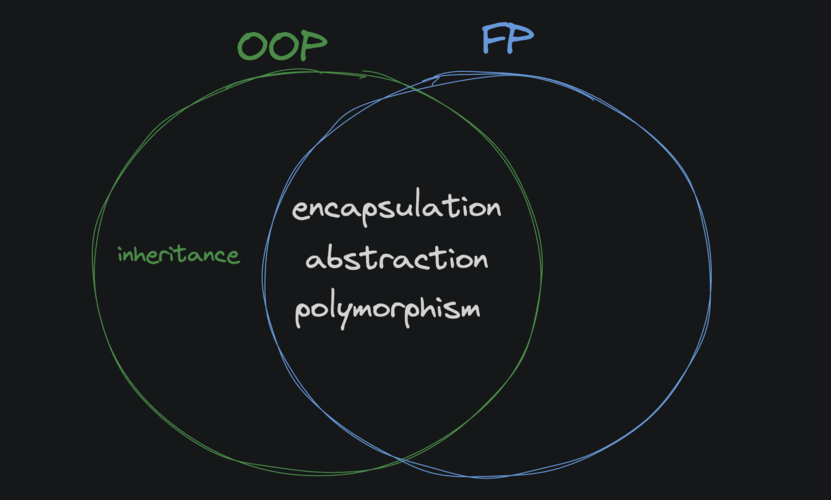

##Functional vs. OOP
Functional programming and object-oriented programming are styles for writing code. One isn't inherently superior to the other, but to be a well-rounded developer you should understand both well and use ideas from each when appropriate.

You'll encounter developers who love functional programming and others who love object-oriented programming. However, contrary to popular opinion, FP and OOP are not always at odds with one another. They aren't opposites. Of the four pillars of OOP, inheritance is the only one that doesn't fit with functional programming.




Inheritance isn't seen in functional code due to the mutable classes that come along with it. Encapsulation, polymorphism and abstraction are still used all the time in functional programming.


When working in a language that supports ideas from both FP and OOP (like Python, JavaScript, or Go) the best developers are the ones who can use the best ideas from both paradigms effectively and appropriately.

!Functions Practice
Doc2Doc should seamlessly convert hex triplet color codes to RGB values. Hex colors are an efficient means of representing color with only 6 characters. RGB values combine red, green and blue light to electronically display the entire color spectrum.

Assignment
Debug the hex_to_rgb function. hex_to_rgb should take a hex triplet color code and return three integers for the RGB values using int(). One of the arguments used in int() is incorrect, examine the documentation to see how to convert hexadecimal values.

Use the provided is_hexadecimal function inside of hex_to_rgb to check if its input is valid. If the input is not a six character long hexadecimal string, raise an exception "not a hex color string".

Example:
```
red_val, green_val, blue_val = hex_to_rgb("A020F0")

print(red_val)
# prints 160

print(green_val)
# prints 32

print(blue_val)
# prints 240


def hex_to_rgb(hex_color):
    if not is_hexadecimal(hex_color) or len(hex_color) != 6:
        raise Exception("not a hex color string")
    r = int(hex_color[:2], 16)
    g = int(hex_color[2:4], 16)
    b = int(hex_color[4:], 16)
    return r, g, b


# Don't edit below this line


def is_hexadecimal(hex_string):
    try:
        int(hex_string, 16)
        return True
    except Exception:
        return False
```